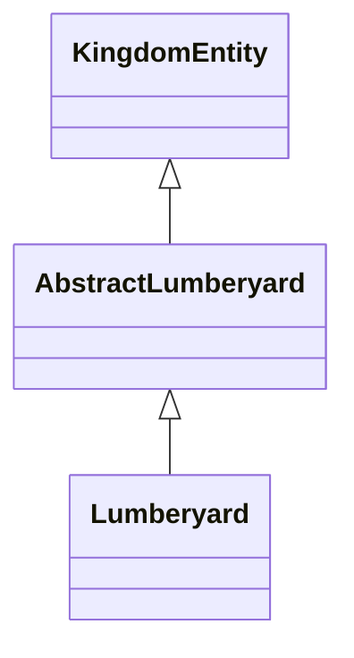

# 🏰 Contributing to OOP Kingdom

Welcome, Builder! Thank you for your interest in contributing to the OOP Kingdom project.

## 📚 Quick Start

1. **Read the Chronicles**: Start with [Chapter 00](../chronicles/chapter-00.md) and [Chapter 01](../chronicles/chapter-01.md) to understand our philosophy
2. **View Week 1 Quest**: Check [quests/week-01/quest.md](../quests/week-01/quest.md) for this week's available entities
3. **Follow Guidelines**: Reference [quests/template.md](../quests/template.md) for comprehensive submission rules
4. **Submit Your PR**: Push your code and create a PR using the [📋 PR Template](PULL_REQUEST_TEMPLATE.md)

---

## 🎯 The Essentials

### 1. Choose Your Entity
- **Lumberyard**: Master of wood harvesting and resource management
- **Barracks**: Commander of training and troop deployment
- **Blacksmith**: Keeper of forging and weapon craftsmanship
- **Market**: Merchant of trade and commerce

### 2. Implement with Excellence
- Extend the abstract class: `public class Lumberyard extends AbstractLumberyard`
- Implement all abstract methods with custom logic
- Use `@JsonProperty` annotations on all fields
- Initialize defaults safely in your constructor (UUID-based identities recommended)
- Register your class: `static { KingdomRegistry.register(Lumberyard.class); }`

### 3. Test Thoroughly
```bash
mvn clean test
```
- Write comprehensive unit tests
- Test Jackson serialization/deserialization
- Verify your entity integrates with CityHall and Farm

### 4. Include UML Diagram
Document your class hierarchy and relationships using Mermaid:


### 5. Follow Naming Conventions
- **Class**: `Lumberyard.java` (PascalCase)
- **Test**: `LumberyardTest.java` (PascalCase + Test)
- **Methods**: `harvestWood()`, `getWoodStockpile()` (camelCase)
- **Fields**: `woodStockpile`, `harvestRate` (camelCase, all @JsonProperty)

---

## ❌ Do NOT

- ❌ Modify other files (only your entity + test allowed!)
- ❌ Modify `pom.xml`, `Main.java`, or any core files
- ❌ Copy code from other contributors
- ❌ Skip writing tests
- ❌ Use AI code generators (heavily discouraged, lower scoring)
- ❌ Violate ethical guidelines (plagiarism = permanent ban)

---

## ✅ Do

- ✅ Write custom, original code
- ✅ Test your implementation thoroughly
- ✅ Include comprehensive Javadoc
- ✅ Create a detailed UML diagram
- ✅ Push early and often
- ✅ Ask questions in issue discussions
- ✅ Review other contributions
- ✅ Learn and have fun!

---

## 🏆 Recognition

Merged contributions are recognized in:
- ✨ **Hall of Contributors**: Your name on the official website
- 📊 **Ranking System**: Settler → Craftsman → Architect → Royal Council
- 🏅 **Hall of Fame**: Permanent record of excellence

---

## 📋 Full Submission Checklist

See [quests/template.md](../quests/template.md) for:
- Pre-submission checklist (✅ 9 items)
- File modification rules
- Do's & Don'ts (📋 22 items)
- PR submission steps
- PR title/description format
- FAQ with 6 common questions

---

## 🔄 Review Process

1. **CI Validation**: GitHub Actions must pass (compile, test, boot)
2. **Code Review**: Maintainers score on 60-point rubric:
   - ✅ CI Pass (Mandatory)
   - 📋 Requirements (10 pts): Abstract methods implemented
   - 🎨 OOP Quality (20 pts): Design, encapsulation, cohesion
   - 🔧 Extensibility (10 pts): Easy to build upon
   - 📊 UML (10 pts): Clear documentation
   - 📝 Naming (10 pts): Conventions followed

3. **Best PR Wins**: Highest-scoring implementation for each entity merges first

4. **Website Credit**: Within 24 hours of merge, you're added to Hall of Contributors

---

## 💬 Questions?

- Check [FAQ in PR Template](PULL_REQUEST_TEMPLATE.md)
- Read [REVIEW_RUBRIC.md](../docs/REVIEW_RUBRIC.md) for scoring details
- Open a discussion in an existing issue
- Post in issue comments with your question

---

## 🚀 Ready?

**[➡️ View Week 1 Quest](../quests/week-01/quest.md)**

**⚔️ The kingdom awaits. Will you answer the call?**
