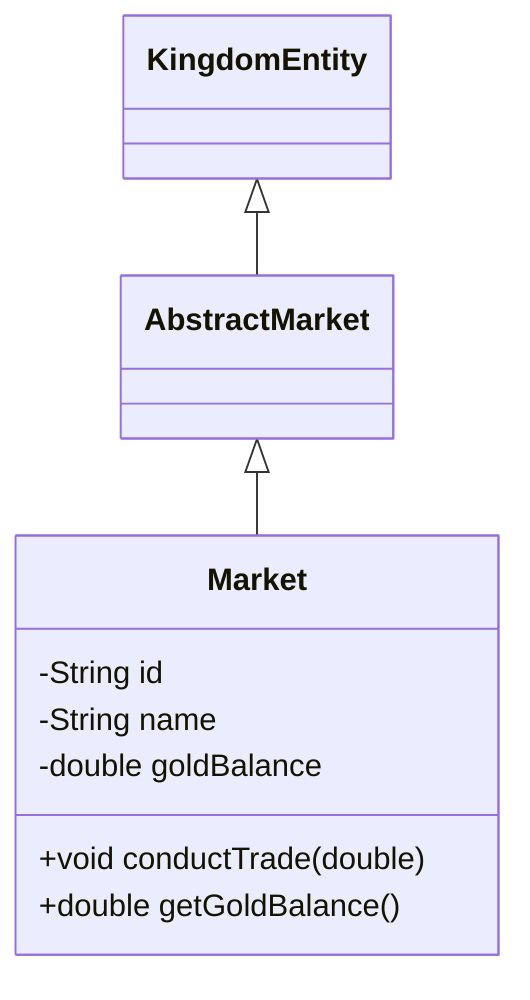

# 🏰 Contributing to OOP Kingdom

Welcome, Builder! This guide covers everything you need to submit a high-quality Pull Request.

> If this is your first time, start with the **[README](../README.md)** for the full story, setup instructions, and step-by-step walkthrough.

---

## 🚀 Quick Checklist

- [ ] **Pick one entity** from the [latest quest](../quests/week-01/quest.md)
- [ ] **Read its contract** in [`kingdom/contracts/`](../kingdom/src/main/java/kingdom/contracts/)
- [ ] **Implement the class** — extend the abstract contract, implement all methods
- [ ] **Add `@JsonProperty`** on every field
- [ ] **Add a no-arg constructor** with UUID-based identity and current date
- [ ] **Add a `static` registration block** — `KingdomRegistry.register(YourClass.class);`
- [ ] **Write unit tests** — constructor, contract methods, extra methods, Jackson serialization
- [ ] **Run tests** — `cd kingdom && mvn clean test` (all must pass)
- [ ] **Create a UML diagram** — Mermaid classDiagram showing your hierarchy
- [ ] **Update [`contributors.json`](../contributors.json)** — add your GitHub username
- [ ] **Open a PR** using the [PR Template](PULL_REQUEST_TEMPLATE.md)

---

## 📏 PR Scope

Each PR must contain **exactly three file changes:**

| File | Location | Purpose |
|------|----------|---------|
| `YourEntity.java` | `kingdom/src/main/java/kingdom/entities/` | Your implementation |
| `YourEntityTest.java` | `kingdom/src/test/java/kingdom/entities/` | Your tests |
| `contributors.json` | Root of repository | Your credit |

Do **not** modify core files (`KingdomEntity.java`, `Kingdom.java`, `CityHall.java`, `Main.java`, `pom.xml`) in your PR. They are maintainer-only.

---

## 📛 Naming Conventions

| Thing | Convention | Example |
|-------|-----------|---------|
| Entity class | `PascalCase` matching contract | `Market.java`, `Blacksmith.java` |
| Test class | `PascalCase` + `Test` | `MarketTest.java`, `BlacksmithTest.java` |
| Methods | `camelCase` | `harvestWood()`, `getWoodStockpile()` |
| Fields / variables | `camelCase` | `woodStockpile`, `foundingDate` |
| Constants | `UPPER_SNAKE_CASE` | `MAX_CAPACITY` |

---

## 📦 Implementation Rules

1. **Extend the quest contract** — `public class Barracks extends AbstractBarracks`
2. **Implement `KingdomEntity`** — provide `getIdentity()`, `getName()`, `getDescription()`, `getFoundingDate()`, `getStatus()`
3. **Annotate all fields** with `@JsonProperty` for Jackson serialization
4. **Provide a no-arg constructor** with safe defaults (UUID-based identity, current date)
5. **Register your class** in a static block:
   ```java
   static {
       KingdomRegistry.register(YourClass.class);
   }
   ```
6. **Extra methods are encouraged** — add business logic beyond the contract, but test everything

---

## 🧪 Testing Requirements

Your test class must verify:

- **Default constructor** — non-null identity, correct defaults
- **Contract methods** — each abstract method works as expected
- **Extra methods** — any additional logic you added
- **Jackson serialization** — write to JSON and read back without data loss

```bash
cd kingdom
mvn clean test
```

All tests must pass. PRs with failing tests are rejected.

---

## 📊 UML Diagram

Every PR must include a Mermaid class diagram. Show your class, its contract parent, and the `KingdomEntity` interface.



---

## 👥 Updating contributors.json

Add yourself to [`contributors.json`](../contributors.json):

- **New class:** `"MyClass": "YourGitHubUsername"`
- **Extending someone else's work:** `"MyClass": "OriginalAuthor, YourGitHubUsername"` — always **append**, never overwrite.

---

## ❌ Common Mistakes

| Mistake | Why It's Rejected |
|---------|-------------------|
| Modifying core files | Maintainer-only — breaks the kingdom |
| Multiple entities in one PR | Impossible to review fairly |
| No tests / untested extra methods | Quality gate violation |
| No UML diagram | Documentation requirement |
| Overwriting contributors.json | Rewrites another builder's credit |
| Plagiarism / AI-generated code | Immediate permanent ban |

---

## 🏆 Review & Promotion

All PRs are scored out of **60 points** using the [Review Rubric](../docs/REVIEW_RUBRIC.md). The highest-scoring implementation gets merged. With each merged PR you advance ranks:

| Rank | Title | Merged PRs |
|:----:|-------|:----------:|
| 🌱 | Settler | 1 |
| ⚒️ | Craftsman | 3 |
| 🏛️ | Architect | 7 |
| 👑 | Royal Council | 15 |

See [RANKS.md](../docs/RANKS.md) for details.

---

## 📚 Reference Docs

| Need | Read This |
|------|-----------|
| Setup & first contribution | [README.md](../README.md) |
| Build & test commands | [BUILD.md](../docs/BUILD.md) |
| OOP principles & naming rules | [CODE_STANDARDS.md](../docs/CODE_STANDARDS.md) |
| Repository layout | [CODE_STRUCTURE.md](../docs/CODE_STRUCTURE.md) |
| Scoring rubric | [REVIEW_RUBRIC.md](../docs/REVIEW_RUBRIC.md) |
| Rank system | [RANKS.md](../docs/RANKS.md) |
| PR template | [PULL_REQUEST_TEMPLATE.md](PULL_REQUEST_TEMPLATE.md) |

**Happy building, Builder. The kingdom grows with every line of code.** ⚔️