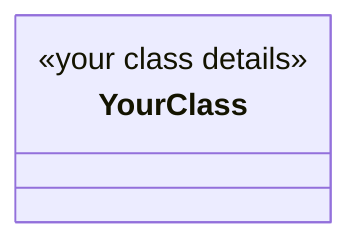

## 📋 What does this PR do?
*Brief description of the class and its role in the kingdom.*

---

## 🎯 Which abstract class does this implement?
- [ ] AbstractLumberyard
- [ ] AbstractBarracks
- [ ] AbstractBlacksmith
- [ ] AbstractMarket
- [ ] Other: ___________

---

## ✨ Key Features
- Feature 1
- Feature 2
- Feature 3

---

## 🧪 Testing
All unit tests pass locally:
```bash
mvn clean test
```
**Results:** 
- ✅ Tests Passed: [X]
- ❌ Tests Failed: [Y]
- ⏭️ Skipped: [Z]

---

## 📊 UML Diagram (Optional)

*Save a Mermaid UML diagram in [`uml/`](../uml/) as a file named after your class (e.g., `uml/market.md`). Include only classes directly related to your implementation — the contract it extends and `KingdomEntity`. Not required, but earns 10 bonus points in the review rubric.*



---

## ✅ Submission Checklist

**Code Quality:**
- [ ] Code follows strict naming conventions (e.g., `Lumberyard.java`, `LumberyardTest.java`)
- [ ] Only my entity class, its test class, and `contributors.json` were modified (no other files touched!)
- [ ] All abstract methods are implemented
- [ ] Default constructor initializes safe defaults with UUID
- [ ] Jackson `@JsonProperty` annotations present on all fields
- [ ] Static registration block included: `static { KingdomRegistry.register(YourClass.class); }`

**Testing:**
- [ ] Unit tests are comprehensive and test business logic
- [ ] Any extra methods implemented have corresponding unit tests verifying their correctness
- [ ] Unit tests verify Jackson serialization works correctly
- [ ] All tests pass locally with `mvn clean test`
- [ ] Application boots without errors with `mvn exec:java -Dexec.mainClass="kingdom.Main"`

**CI & Documentation:**
- [ ] CI passes (GitHub Actions)
- [ ] UML diagram in `uml/` folder showing only directly related classes (optional, +10 pts)
- [ ] No modifications to README, pom.xml, Main.java, or other core files
- [ ] `contributors.json` updated (name added, or appended with comma if extending an existing class)
- [ ] Commit message(s) are clear and descriptive

---

## 📝 Design Notes
*Explain any key design decisions, edge cases handled, or interesting implementation choices. If you added extra methods, list them and explain their purpose.*

---

## 🚀 Ready for Review?
- [ ] Yes, this PR is ready for the community to review and score
- [ ] No, still working on it (mark as Draft)

---

> 💡 **Reminder:** Only 3 files should be modified in this PR:
> 1. Your implementation class (e.g., `Lumberyard.java`)
> 2. Your test class (e.g., `LumberyardTest.java`)
> 3. The `contributors.json` file to log your credit
>
> Any other file modifications (except under docs if approved by maintainers) will result in automatic PR rejection.
>
> See [Quest Submission Guidelines](../quests/template.md) for complete details.
