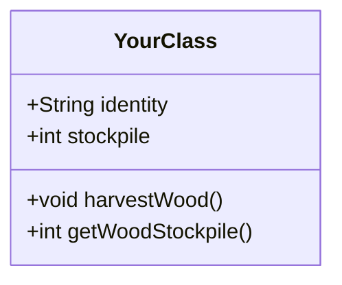
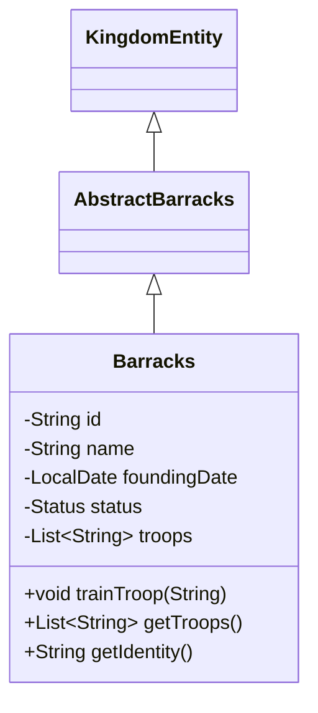

# ⚔️ OOP Kingdom

> _A collaborative open-source kingdom built entirely through object-oriented Java code._

---

## 📖 The Story

For centuries, the **POP Kingdom** (Procedural-Oriented Programming) stood unchallenged. Its laws were absolute — every citizen followed the same procedures, the same rigid sequence of instructions, dictated from the Royal Throne of `main()`. A baker followed the same routine as a blacksmith. A farmer followed the same routine as a soldier. No deviation. No individuality. No freedom.

But thirty-seven souls dared to question:

_Why must the blacksmith know the baker's recipe to do his work?_
_Why cannot each citizen own their own data, their own methods, their own purpose?_

They called it **Object-Oriented Programming** — a philosophy where every entity is master of its own domain. Branded as heretics, they were exiled beyond the eastern border.

They walked through mountains and forests, through hunger and despair, until they found an untouched valley. There, they planted a banner and declared:

> **"Here we build the OOP Kingdom — where every entity is master of its own destiny, every citizen builds according to their nature, and every contribution is valued."**

The kingdom has grown. But it is not complete.

**New buildings are needed. New quests await. The kingdom needs builders.**

> Read the full chronicles: [Chapter 00 — The Rebellion](chronicles/chapter-00.md) · [Chapter 01 — The Founding](chronicles/chapter-01.md)

---

## 🏰 What is OOP Kingdom?

OOP Kingdom is a collaborative open-source project where contributors collectively build a virtual kingdom — entirely through **Java** code.

Every week, a new quest drops describing what the kingdom needs next — a marketplace, a blacksmith, a postal system. Contributors design and implement these as real object-oriented classes and raise a Pull Request. The best implementation gets merged and becomes official canon.

**This is the closest thing to contributing to a real codebase — without needing to be hired first.**

Whether you're a beginner learning Java and OOP, or an experienced developer wanting a fun side project, **you can contribute.**

---

## 🚀 Quick Start — New Here?

| Step | What to do |
|------|------------|
| 1️⃣ | Read [SETUP.md](docs/SETUP.md) — fork, clone, install Java 17 & Maven |
| 2️⃣ | Read [Chapter 00](chronicles/chapter-00.md) to understand the world |
| 3️⃣ | Study [Lumberyard.java](kingdom/src/main/java/kingdom/entities/Lumberyard.java) — it's your reference implementation |
| 4️⃣ | Open [quests/week-01/quest.md](quests/week-01/quest.md) and pick a building to implement |
| 5️⃣ | Build it, test it, raise a PR! |

> 💡 Stuck? Open a [Discussion](https://github.com/Hemanthkumar2k04/OOP-Kingdom/discussions) and ask — no question is too basic.

---

## ⚙️ How It Works

```
📜 Weekly Quest  →  🛠️ You Code  →  📬 Raise a PR  →  👑 Best PR Merged  →  🏙️ Kingdom Grows
```

| Step | What Happens |
|------|-------------|
| **1. Quest drops** | A `quest.md` is released with new buildings the kingdom needs |
| **2. You pick an entity** | Choose one — Barracks, Blacksmith, Market, or whatever is available |
| **3. You implement it** | Write your class and its tests (a UML diagram earns bonus points) |
| **4. You raise a PR** | Open a Pull Request with your code, tests, and optional UML diagram |
| **5. Community reviews** | All PRs are scored against the [Review Rubric](docs/REVIEW_RUBRIC.md) |
| **6. Best design wins** | The highest-scoring implementation gets merged |

---

## 🛠️ Prerequisites

Before you can build, you need these tools installed on your machine.

### 1. Java Development Kit (JDK) 17+

**Check if you have it:**
```bash
java -version
```
You need version **17 or higher**.

**Install if needed:**

| OS | Command |
|----|---------|
| **Ubuntu / Debian** | `sudo apt install openjdk-17-jdk` |
| **macOS (Homebrew)** | `brew install openjdk@17` |
| **Windows** | Download from [adoptium.net](https://adoptium.net/) |
| **Any (SDKMAN)** | `sdk install java 17.0.9-tem` |

### 2. Apache Maven

**Check if you have it:**
```bash
mvn --version
```

**Install if needed:**

| OS | Command |
|----|---------|
| **Ubuntu / Debian** | `sudo apt install maven` |
| **macOS (Homebrew)** | `brew install maven` |
| **Windows** | Download from [maven.apache.org](https://maven.apache.org/download.cgi) |
| **Any (SDKMAN)** | `sdk install maven` |

### 3. Git

**Check:**
```bash
git --version
```
If missing, install via your package manager or [git-scm.com](https://git-scm.com/).

> See [SETUP.md](docs/SETUP.md) for a detailed step-by-step walkthrough with screenshots.

---

## 📦 Clone & Setup

```bash
# Clone the repository
git clone https://github.com/Hemanthkumar2k04/OOP-Kingdom.git
cd OOP-Kingdom

# All build commands run from the kingdom/ subdirectory
cd kingdom
```

---

## 🧪 Compile & Run Tests

All commands must be run from the `kingdom/` directory.

### Compile the code
```bash
mvn clean compile
```

### Run all tests
```bash
mvn clean test
```

### Boot sanity check
```bash
mvn exec:java -Dexec.mainClass="kingdom.Main"
```

> **Expected result:** `BUILD SUCCESS` and 36 passing tests. If anything fails, make sure you have Java 17+ and Maven installed correctly.

---

## 📜 The Rules

### PR Scope — One Class Per PR

Each Pull Request must contain **exactly three files:**

```
YourEntity.java          # Your implementation class
YourEntityTest.java      # Your test class
contributors.json        # Updated with your credit
```

Do **not** bundle multiple entities, modify core files (`KingdomEntity.java`, `Kingdom.java`, `CityHall.java`, `pom.xml`), or touch unrelated configuration.

### Naming Conventions

| Thing | Convention | Example |
|-------|-----------|---------|
| Entity class | `PascalCase` matching the contract | `Market.java`, `Blacksmith.java` |
| Test class | `PascalCase` + `Test` | `MarketTest.java`, `BlacksmithTest.java` |
| Methods | `camelCase` | `harvestWood()`, `getWoodStockpile()` |
| Fields | `camelCase` | `woodStockpile`, `foundingDate` |
| Constants | `UPPER_SNAKE_CASE` | `MAX_CAPACITY` |

### UML Diagram (Optional — Bonus Points)

A Mermaid UML diagram earns you **10 bonus points** on the scoring rubric. You can still submit without one — you just miss out on those points.

**Where to put it:** Save your diagram as a `.md` file in the [`uml/`](uml/) folder named after your class (e.g., `uml/barracks.md`).

**What to include:** Only classes directly related to your implementation — the contract it extends and `KingdomEntity`. Do **not** diagram the entire kingdom hierarchy (CityHall, Farm, Lumberyard, etc.). Keep it focused on your entity.

Example — `uml/barracks.md`:



---

## 🚀 How to Contribute — Step by Step

### Step 1 — Find a quest

Check [`quests/`](quests/) for the latest quest. Each quest lists available entities. Pick **one**.

### Step 2 — Read the contract

Each entity has an abstract class or interface in [`kingdom/src/main/java/kingdom/contracts/`](kingdom/src/main/java/kingdom/contracts/). Study its methods — you must implement all of them.

| Entity | Contract | 
|--------|----------|
| Lumberyard | `AbstractLumberyard` — `harvestWood()`, `getWoodStockpile()` |
| Barracks | `AbstractBarracks` — `trainTroop()`, `getTroops()` |
| Blacksmith | `AbstractBlacksmith` — `forgeWeapon()`, `getWeaponCount()`, `repairAnvil()` |
| Market | `AbstractMarket` — `conductTrade()`, `getGoldBalance()` |

### Step 3 — Implement your class

Create your class in [`kingdom/src/main/java/kingdom/entities/`](kingdom/src/main/java/kingdom/entities/).

**Required boilerplate:**

```java
package kingdom.entities;

import com.fasterxml.jackson.annotation.JsonProperty;
import java.time.LocalDate;
import java.util.UUID;
import kingdom.contracts.AbstractBarracks; // or your contract
import kingdom.core.KingdomRegistry;

public class Barracks extends AbstractBarracks {

    static {
        KingdomRegistry.register(Barracks.class);
    }

    @JsonProperty("identity")
    private String id;

    @JsonProperty
    private String name;

    @JsonProperty
    private String description;

    @JsonProperty
    private LocalDate foundingDate;

    @JsonProperty
    private Status status;

    // Default constructor for serialization
    public Barracks() {
        this.id = "BARRACKS-" + UUID.randomUUID().toString().substring(0, 8).toUpperCase();
        this.name = "Barracks";
        this.description = "...";
        this.foundingDate = LocalDate.now();
        this.status = Status.UNDER_CONSTRUCTION; // Default — freshly deserialized
    }

    // Parameterized constructor for explicit creation
    public Barracks(String name, String description) {
        this.id = "BARRACKS-" + UUID.randomUUID().toString().substring(0, 8).toUpperCase();
        this.name = name;
        this.description = description;
        this.foundingDate = LocalDate.now();
        this.status = Status.OPERATIONAL; // Explicitly built
    }

    // Implement all abstract methods from the contract
    @Override
    public void trainTroop(String troopName) { /* ... */ }

    @Override
    public List<String> getTroops() { /* ... */ }

    // Implement KingdomEntity methods
    @Override public String getIdentity() { return id; }
    @Override public String getName() { return name; }
    @Override public String getDescription() { return description; }
    @Override public LocalDate getFoundingDate() { return foundingDate; }
    @Override public Status getStatus() { return status; }
}
```

**Checklist:**
- [ ] Extends the quest's abstract contract
- [ ] Implements all abstract methods
- [ ] Has `@JsonProperty` on every field
- [ ] Has a no-arg constructor with safe defaults (UUID identity, current date, `UNDER_CONSTRUCTION` status)
- [ ] Has a parameterized constructor (if applicable) with `OPERATIONAL` status
- [ ] Has a `static { KingdomRegistry.register(...); }` block
- [ ] Implements all `KingdomEntity` interface methods

### Step 4 — Write tests

Create your test class in [`kingdom/src/test/java/kingdom/entities/`](kingdom/src/test/java/kingdom/entities/).

Your tests must cover:

| Test Type | What to Verify |
|-----------|---------------|
| **Constructor** | Safe defaults — non-null UUID identity, correct name, current date |
| **Contract methods** | Each abstract method works correctly |
| **Business logic** | Extra methods you added do what they should |
| **Jackson serialization** | Your entity can be written to JSON and read back without losing state |

Run them:
```bash
cd kingdom
mvn clean test
```

All tests must pass.

### Step 5 — Draw your UML diagram (optional, +10 pts)

Save it in [`uml/`](uml/) as a `.md` file named after your class (e.g., `uml/barracks.md`). Create a Mermaid `classDiagram` showing only your class, its parent contract, and `KingdomEntity` — **not** the entire kingdom tree. This is **not required**, but it earns you 10 points during review:



### Step 6 — Update `contributors.json`

Add yourself in the root [`contributors.json`](contributors.json):

- **New class:** `"YourClass": "YourGitHubUsername"`
- **Extending someone's work:** `"YourClass": "OriginalAuthor, YourGitHubUsername"` — append, don't overwrite.

### Step 7 — Raise your PR

Open a Pull Request on GitHub. Use the [PR Template](.github/PULL_REQUEST_TEMPLATE.md). Include a brief explanation of your design decisions and optionally link to your UML diagram from the `uml/` folder.

---

## 🗺️ Repository Structure

```
OOP-Kingdom/
├── kingdom/                          # The Java codebase
│   └── src/
│       ├── main/java/kingdom/
│       │   ├── core/                 # Base interfaces & enums (KingdomEntity)
│       │   ├── contracts/            # Quest abstract contracts
│       │   ├── entities/             # All kingdom classes (your code goes here)
│       │   ├── Kingdom.java
│       │   └── Main.java
│       └── test/java/kingdom/        # Tests
├── quests/                           # Weekly quest drops
│   ├── template.md                   # Quest submission guidelines
│   └── week-01/quest.md
├── chronicles/                       # The kingdom's story
│   ├── chapter-00.md
│   └── chapter-01.md
├── uml/                              # UML diagrams (one .md file per class)
├── docs/                             # Documentation
│   ├── BUILD.md                      # Build & test commands
│   ├── CODE_STANDARDS.md             # OOP principles & naming rules
│   ├── CODE_STRUCTURE.md             # Full repo layout
│   ├── OOP_GUIDE.md                  # OOP concepts explainer
│   ├── REVIEW_RUBRIC.md              # PR scoring rubric
│   ├── RANKS.md                      # Contributor rank system
│   └── SETUP.md                      # Java/Maven install walkthrough
├── state/                            # Persistent state (auto-generated)
├── .github/                          # GitHub templates & CI
│   ├── CONTRIBUTING.md
│   ├── PULL_REQUEST_TEMPLATE.md
│   ├── ISSUE_TEMPLATE/
│   └── workflows/ci.yml
├── contributors.json                 # Who built what
├── LICENSE                           # MIT License
└── README.md
```

---

## 🏆 PR Review & Ranks

### Scoring Rubric

All PRs are scored out of **60 points**. Highest score wins the merge.

| Criteria | Points | Description |
|----------|:------:|-------------|
| Passes CI | Mandatory | Must compile, all tests pass |
| Follows quest requirements | 10 | All functional requirements met |
| OOP quality | 20 | SRP, encapsulation, inheritance, polymorphism |
| Extensibility | 10 | Future contributors can build on it |
| UML accuracy | 10 | Diagram matches the code |
| Naming & readability | 10 | Clean code, JavaDoc, descriptive names |

See the full [Review Rubric](docs/REVIEW_RUBRIC.md) for details.

### Contributor Ranks

| Rank | Title | Requirement |
|:----:|-------|:-----------:|
| 🌱 | **Settler** | 1 merged PR |
| ⚒️ | **Craftsman** | 3 merged PRs |
| 🏛️ | **Architect** | 7 merged PRs |
| 👑 | **Royal Council** | 15 merged PRs |

See [Contributor Ranks](docs/RANKS.md) for the full breakdown.

---

## 📚 All Documentation

| Document | Description |
|----------|-------------|
| [SETUP.md](docs/SETUP.md) | Java & Maven install guide for beginners |
| [OOP_GUIDE.md](docs/OOP_GUIDE.md) | OOP concepts explained with kingdom examples |
| [Contributing Guide](.github/CONTRIBUTING.md) | Full contribution rules & checklist |
| [Building & Testing](docs/BUILD.md) | All Maven commands in detail |
| [Code Standards](docs/CODE_STANDARDS.md) | OOP principles, naming, testing standards |
| [Code Structure](docs/CODE_STRUCTURE.md) | Repository layout & core components |
| [Review Rubric](docs/REVIEW_RUBRIC.md) | How PRs are judged |
| [Contributor Ranks](docs/RANKS.md) | Ranks and rewards |
| [PR Template](.github/PULL_REQUEST_TEMPLATE.md) | Template to use when opening PRs |
| [Quest Guidelines](quests/template.md) | Quest submission rules |
| [Chronicles — Ch 00](chronicles/chapter-00.md) | The Rebellion — full origin story |
| [Chronicles — Ch 01](chronicles/chapter-01.md) | The Founding — how the kingdom began |
| [License](LICENSE) | MIT — free to use, modify, distribute |

---

## ⚖️ License

This project is open source under the [MIT License](LICENSE). Free to use, modify, and distribute.

---

## 🌐 Website

The kingdom's live state, story, and contributor hall of fame lives at:
**[oop-kingdom.github.io](https://oop-kingdom.github.io)** _(coming soon)_

---

_Every entity deserves its own purpose. Every contributor deserves their credit. Build well._

**⚔️ The kingdom awaits.**